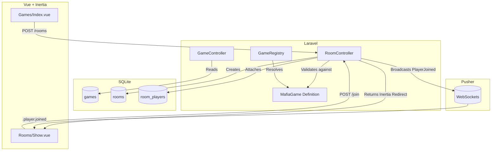

# Games Center — Complete Project Context Report

> Generated from direct analysis of the project source code.
> This document describes the project as it exists at the time of analysis.

## 1. Project Overview

The Games Center application is a real-time multiplayer game platform. It allows users to browse available games (currently focusing on "Mafia"), create game rooms with custom configurations, join existing rooms via room codes, and eventually play the game.

**Current Intended User Flow**:

1. User logs in.
2. User navigates to the Games list.
3. User selects a game (e.g., Mafia) and creates a room as the Host.
4. Other users join the room as Players.
5. The Host starts the game when the minimum player requirement is met.
6. The room transitions into an in-progress state, and gameplay begins.

**Current Implemented User Flow**:

1. User can register and log in.
2. User can see the Mafia game and its configuration schema.
3. User can create a room, which redirects them to the Room Show page.
4. Other users can join the room. The Host sees them join in real-time.
5. The Host can click "Start Game" when enough players join.
   _Note: The actual gameplay phase is not implemented yet. The game start process contains a critical bug (detailed below) that disrupts the flow._

**Major Features**:

- Game definition registry allowing abstract game rules.
- Room creation and joining.
- Real-time updates when players join.
- Authentication and Profile management (Laravel Starter Kit).

**Technologies/Frameworks**:

- **Backend Architecture**: Laravel 12 on PHP 8.2. Uses SQLite (by default) for the database.
- **Frontend Architecture**: Vue 3 with Composition API and TypeScript, served through Inertia.js (v2) and Vite. Styled with Tailwind CSS.
- **Real-time Architecture**: Laravel Echo and Pusher (pusher-js and pusher-php-server) for WebSocket broadcasting.
- **Authentication**: Laravel Breeze (session-based authentication).

## 2. Technology Stack

- **Laravel (v12.0+)**: Core backend framework. Configured in `bootstrap/app.php` and `config/`.
- **PHP (v8.2+)**: Server-side language.
- **Vue (v3.5.13)**: Frontend framework used for all UI components, using Composition API (`<script setup>`).
- **TypeScript (v5.2.2)**: Used for Vue components to ensure type safety on the frontend.
- **Inertia.js (v2.0)**: Connects Laravel backend with Vue frontend without building a traditional API. Configured via `HandleInertiaRequests` middleware.
- **Vite (v6.0.3)**: Frontend build tool and development server.
- **Tailwind CSS (v3.4.1)**: Utility-first CSS framework for styling.
- **Laravel Echo & Pusher (pusher-js v8.6, pusher-php-server v7.3)**: Handles real-time WebSocket events. Echo is configured in `resources/js/app.ts`, and Pusher is configured in `config/broadcasting.php`.
- **Pest (v3.8)**: Testing framework used for backend feature tests.
- **SQLite**: Default database (as per `.env.example`).

## 3. Complete Project Structure

- `app/Events/`: Contains real-time event classes (`PlayerJoined.php`).
- `app/Games/`: Contains the core game architecture.
    - `Contracts/GameDefinition.php`: Interface for all games.
    - `AbstractGame.php`: Base class for games.
    - `GameRegistry.php`: Maps game slugs to classes.
    - `Mafia/MafiaGame.php`: Specific implementation for the Mafia game.
- `app/Http/Controllers/`: Contains the logic for HTTP requests.
    - `RoomController.php`: Handles room creation, joining, starting, and displaying.
    - `GameController.php`: Handles listing available games.
    - `Auth/` & `Settings/`: Standard Breeze authentication controllers.
- `app/Models/`: Eloquent ORM models (`User.php`, `Game.php`, `Room.php`).
- `resources/js/pages/`: Vue components for Inertia.
    - `Games/Index.vue`: Game listing and room creation UI.
    - `Rooms/Show.vue`: The waiting room and player list UI.
- `routes/`:
    - `web.php`: Defines Inertia and HTTP routes.
    - `channels.php`: Defines authorization for WebSocket channels.
- `database/migrations/`: Database schema definitions.
- `tests/Feature/`: Pest tests, notably `RoomTest.php`.

## 4. Database and Data Model

**`users` table**:
Standard Laravel user table (id, name, email, password, etc.).

- **Relationships**: `rooms` (as host), `rooms` (as player via pivot).

**`games` table**:

- **Columns**: `id`, `name`, `slug` (unique), `description`, `enabled` (boolean, default true).
- **Relationships**: Has many `rooms`.

**`rooms` table**:

- **Columns**:
    - `id`
    - `game_id` (FK to games)
    - `host_id` (FK to users)
    - `code` (string, 6 uppercase hex chars)
    - `max_players` (integer)
    - `configuration` (JSON, stores game-specific settings)
    - `game_state` (JSON, stores current game progress, added via separate migration)
    - `status` (string, default 'waiting')
- **Indexes**: `[game_id, status]`, `[host_id, status]`.
- **Relationships**: Belongs to `game`, belongs to `host` (User), belongs to many `players` (User).
- **Helper methods**: `isWaiting()`, `isInProgress()`, `isFinished()`.

**`room_players` table (Pivot)**:

- **Columns**: `id`, `room_id`, `user_id`.
- **Constraints**: Unique constraint on `[room_id, user_id]`.

_Note: Game rules and definitions are NOT stored in the database. The `games` table only stores basic metadata (name, slug). The actual rules are in the code._

## 5. Game Architecture

The architecture heavily relies on the Code (not DB) as the source of truth for game rules.

1. **`GameRegistry`** (`app/Games/GameRegistry.php`): Maps a string slug (e.g., `'mafia'`) to a class (`MafiaGame::class`).
2. **`GameDefinition`** (`app/Games/Contracts/GameDefinition.php`): Interface defining required methods:
    - `minimumPlayers()`
    - `maximumPlayers()`
    - `hostIsPlayer()` (Determines if the room creator is automatically added as a player)
    - `configurationSchema()` (Returns a schema array to build the UI form and validate inputs)
    - `initializeState(Room $room)` (Returns the initial JSON state for the game)
3. **`MafiaGame`** (`app/Games/Mafia/MafiaGame.php`):
    - Implements `GameDefinition` (via `AbstractGame`).
    - Defines minimum 5 players, maximum 20.
    - `hostIsPlayer()` returns `false` (Host manages the game but doesn't play).
    - Configuration schema includes `mafia_count` (integer), `doctor` (boolean), `detective` (boolean).
    - Initializes state with `['phase' => 'setup', 'round' => 1]`.

The connection between the DB and the Game logic happens by reading the `slug` from the `Game` model and passing it to `GameRegistry::get($slug)`.

## 6. Routes

Defined in `routes/web.php`:

- `GET /games`: `GameController@index`. Returns Inertia page `Games/Index`.
- `GET /rooms/{room:code}`: `RoomController@show`. Returns Inertia page `Rooms/Show`.
- `POST /rooms`: `RoomController@store`. Creates a room and redirects.
- `POST /rooms/{room}/join`: `RoomController@join`. Joins a room and redirects.
- `POST /rooms/{room}/start`: `RoomController@start`. Starts the game. **Returns JSON (Inconsistency!)**.

Defined in `routes/channels.php`:

- `rooms.{room}`: Authorizes if the user is the host or a player in the room.

## 7. Controllers

**`GameController`**:

- `index()`: Fetches enabled games from DB, merges them with definition logic (min/max players, schema) from `GameRegistry`, and sends them to the frontend.

**`RoomController`**:

- `store()`: Validates input against the game's `configurationSchema`. Creates the room. Generates a unique 6-character hex code. If `hostIsPlayer()` is true, attaches the host as a player. Redirects to `rooms.show`.
- `show()`: Loads room, game, host, and players relationships. Formats the data into an array for the Inertia page.
- `join()`: Validates if room is waiting, user isn't already inside, and room isn't full. Attaches user. Broadcasts `PlayerJoined` event. Redirects to `rooms.show`.
- `start()`: Validates if user is host, room is waiting, and min/max players are respected. Initializes game state via `GameDefinition::initializeState()`. Updates room status to `in_progress`. **Returns a JSON response instead of an Inertia redirect/response.**

## 8. Inertia Architecture

- **Setup**: Uses standard Laravel Vite Plugin and Ziggy for routing.
- **Responses**: Most endpoints return Inertia responses or redirects, which are seamlessly handled by Vue.
- **Inconsistency**: The `router.post('/rooms/{room}/start')` call in `Rooms/Show.vue` expects an Inertia response. However, `RoomController@start` returns `response()->json(...)`. This causes Inertia to throw a modal error on the frontend: _"All Inertia requests must receive a valid Inertia response, however a plain JSON response was received."_

## 9. Frontend Architecture

- **`Games/Index.vue`**:
    - Displays a list of games.
    - When a game is clicked, dynamically renders a configuration form based on `configuration_schema`.
    - Sends a `router.post` to create the room.
- **`Rooms/Show.vue`**:
    - Displays room details (code, host, player list, configuration).
    - Determines user role (`isHost`, `isPlayer`) via computed properties.
    - Subscribes to `rooms.{id}` Pusher channel on mount. Listens for `.player.joined` and triggers `router.reload({ only: ['room'] })` to refresh data.
    - Has a "Join Room" button for non-players.
    - Has a "Start Game" button for the host. It calculates `playersNeeded` based on the game's minimum players.

## 10. Room Lifecycle

1. **Creation**: User selects game, fills config. `RoomController@store` validates, creates a DB record with status `waiting`, generates a unique `code`, and redirects. (For Mafia, the host is not added to `room_players`).
2. **Display**: Inertia receives formatted room data in `Rooms/Show.vue`.
3. **Joining**: Another user visits the URL. Clicks "Join". `RoomController@join` validates capacity and uniqueness, attaches user to pivot table, broadcasts `PlayerJoined`, and redirects.
4. **Real-time Update**: Host's browser receives `PlayerJoined` via Echo, triggers an Inertia partial reload, updating the player list without a full page refresh.
5. **Starting**: Host clicks "Start". `RoomController@start` validates conditions, updates DB `status` to `in_progress` and `game_state` to initial setup.
    - _Broken Part_: The controller returns JSON, breaking the frontend. Also, there is no event broadcasted to notify the other players that the game has started.

## 11. Real-Time / Pusher / Echo Architecture

- **Backend Setup**: `config/broadcasting.php` is configured for Pusher. Events implement `ShouldBroadcastNow`.
- **Channel**: `PrivateChannel('rooms.' . $this->room->id)`
- **Event**: `PlayerJoined` event broadcasts as `'player.joined'`.
- **Authorization**: `routes/channels.php` authorizes users if they are the host or exist in the `room_players` table.
- **Frontend Setup**: `resources/js/app.ts` initializes Echo using Pusher.
- **Subscription**: `Show.vue` uses `window.Echo.private(...).listen('.player.joined', ...)` (Note the dot, which correctly prevents Echo from appending the default namespace).
- **Cleanup**: `onUnmounted` calls `window.Echo.leave(...)`.

## 12. Events

- **`App\Events\PlayerJoined`**:
    - **Trigger**: Fired in `RoomController@join`.
    - **Channel**: `private-rooms.{id}`
    - **Event Name**: `player.joined`
    - **Payload**: Contains the newly joined player's ID and Name.
    - **Frontend Handling**: Triggers an Inertia reload of the `room` prop.
- **Missing Events**: There is no `GameStarted` event. When the host starts the game, players are not notified.

## 13. Authentication and Authorization

- Standard Laravel Breeze auth is fully implemented.
- **Room Authorization**: Handled inline within controllers.
    - Only Host can start the game (`if ($room->host_id !== $user->id)`).
    - Only authenticated users can access `/games` and `/rooms`.
- **Broadcast Authorization**: Users can only listen to a room channel if they are the host or a joined player.

## 14. Validation and Error Handling

- **Room Creation**: Validates min/max players and loops through `configurationSchema` to validate specific dynamic inputs (type checking, min/max).
- **Joining/Starting**: Validation exceptions are thrown using `ValidationException::withMessages()`, which Inertia automatically maps to frontend `errors` props.
- **Inconsistencies**: `RoomController@start` manually returns a `403` or `422` JSON response instead of throwing a `ValidationException` or redirecting, causing a frontend crash.

## 15. Tests

- **`tests/Feature/RoomTest.php`** is highly comprehensive and accurate.
    - `test_host_can_create_a_room` (Passes)
    - `test_user_can_join_a_waiting_room` (Passes)
    - `test_user_cannot_join_a_room_twice` (Passes)
    - `test_user_cannot_join_a_room_that_has_started` (Passes)
    - `test_user_cannot_join_a_full_room` (Passes)
    - `test_host_cannot_start_a_room_with_too_few_players` (Passes)
    - `test_only_host_can_start_a_room` (Passes)
    - `test_host_can_start_room_when_minimum_players_are_present` (Passes - Tests the JSON response behavior, meaning the test _expects_ JSON, which contradicts the frontend Inertia setup).
    - `test_room_can_be_retrieved_with_game_host_and_players` (Passes)
- **Not Tested**: Real-time broadcasting is not explicitly tested. The missing `GameStarted` event is not caught.

## 16. Current Mafia Implementation

- **Rules defined in `MafiaGame.php`**:
    - **Min Players**: 5
    - **Max Players**: 20
    - **Host Participation**: Host is NOT a player.
    - **Configuration**: `mafia_count` (int, min 1), `doctor` (bool), `detective` (bool).
    - **Initial State**: `['phase' => 'setup', 'round' => 1]`
- **Status**: The setup and configuration are fully implemented. Actual gameplay logic (phases, roles, voting) is completely missing.

## 17. Current UI Behavior

- **Games Page (`/games`)**: Shows list of games. Clicking Mafia opens a form for max players, mafia count, doctor, and detective toggles.
- **Room Page (`/rooms/{code}`)**:
    - Shows room code and status.
    - **Host View**: Sees themselves as "Host · You". Sees a "Start Game" button that shows how many more players are needed.
    - **Non-Player View**: Sees a "Join Room" button.
    - **Player View**: Sees they are in the room. No start button.
    - **Real-time**: The player list updates instantly when a new player joins.

## 18. Configuration and Environment

Relevant `.env` variables required for application behavior:

- `DB_CONNECTION=sqlite` (Default)
- `BROADCAST_CONNECTION` = expected to be `pusher` for real-time.
- `PUSHER_APP_KEY`, `PUSHER_APP_SECRET`, `PUSHER_APP_ID`, `PUSHER_APP_CLUSTER` = Required for backend broadcasting.
- `VITE_PUSHER_APP_KEY`, `VITE_PUSHER_APP_CLUSTER` = Required for frontend Echo connection.
  _(Note: The `.env.example` file defaults to `BROADCAST_CONNECTION=log` and does not include the Pusher keys, though `app.ts` expects them)._

## 19. Current Known Problems

### Confirmed Bugs

1. **Inertia JSON Response Crash**
    - **Description**: Host clicking "Start Game" crashes the frontend with an Inertia modal error.
    - **Affected Files**: `RoomController.php` (`start` method), `Rooms/Show.vue`.
    - **Cause**: Controller returns `response()->json(...)` instead of an Inertia redirect/response, but `Show.vue` calls `router.post()`.
2. **Missing GameStarted Event**
    - **Description**: Players in a room are not notified when the host starts the game.
    - **Affected Files**: `RoomController.php`, `app/Events/`.
    - **Cause**: No broadcast event is fired upon game start.

### Technical Debt / Architectural Inconsistencies

1. **Tests encourage bad behavior**: `RoomTest.php` uses `$this->postJson("/rooms/{$room->id}/start")` and asserts a 200 OK JSON response. The test explicitly verifies the broken behavior.
2. **Environment Variables**: `.env.example` is missing the Pusher/Vite environment variables needed to spin up the project easily.
3. **Leftover Console Logs**: `Show.vue` contains `console.log('Game:', props.room.game)`.

### Missing Functionality

1. **Gameplay UI**: There is no UI for what happens _after_ the game starts (status changes to `in_progress`, but the UI doesn't react or show a game board).
2. **Leaving a Room**: Players have no way to leave a room once joined.

## 20. Current Implementation Status

| Feature                  | Status          | Details                                                          |
| ------------------------ | --------------- | ---------------------------------------------------------------- |
| Authentication           | Complete        | Laravel Breeze standard setup.                                   |
| Game registry            | Complete        | `GameRegistry` correctly resolves classes.                       |
| Game definitions         | Complete        | Architecture supports multiple game schemas.                     |
| Game listing             | Complete        | Fetches from DB and merges definition data.                      |
| Room creation            | Complete        | Correctly generates codes and schemas.                           |
| Room display             | Complete        | Inertia renders relationships properly.                          |
| Room joining             | Complete        | Validates capacity and uniqueness.                               |
| Real-time player updates | Complete        | Pusher/Echo updates player list instantly.                       |
| Start game               | **Broken**      | Backend returns JSON, breaking Inertia. Missing broadcast event. |
| Game state               | Prototype       | Initial state is generated, but unused.                          |
| Mafia gameplay           | Not implemented | Only setup exists; no gameplay logic.                            |
| Multiple games           | Prototype       | Architecture supports it, only Mafia exists.                     |

## 21. Architecture Diagram

## 22. Important Code References

- `app/Games/Contracts/GameDefinition.php`: The interface dictating how games define rules, player limits, and schemas.
- `app/Games/GameRegistry.php`: The factory resolving game slugs to definitions.
- `app/Games/Mafia/MafiaGame.php`: The source of truth for Mafia game rules.
- `app/Http/Controllers/RoomController.php`: Handles the entire room lifecycle (Create, Join, Start).
- `resources/js/pages/Rooms/Show.vue`: The frontend hub for real-time room interactions.
- `app/Events/PlayerJoined.php`: The real-time broadcasting event.

## 23. Recommended Next Steps

1. **Fix the Start Game Flow**:
    - Change `RoomController@start` to return a `redirect()->route('rooms.show', $room)` (or `back()`) instead of a JSON response.
    - Throw `ValidationException` instead of returning 403/422 JSON responses in `start()`.
    - Update `RoomTest.php` to assert redirects instead of JSON structures.
2. **Implement GameStarted Broadcast Event**:
    - Create a `GameStarted` event.
    - Dispatch it inside `RoomController@start`.
    - Listen for it in `Rooms/Show.vue` to trigger an Inertia reload (or navigate to a gameplay component).
3. **Implement Basic Gameplay UI**:
    - Update `Rooms/Show.vue` to display a different view if `room.status === 'in_progress'`.
4. **Implement "Leave Room" Feature**:
    - Add a route and controller method for players to detach themselves from `room_players`.

## 24. Final AI Handoff Summary

### AI HANDOFF CONTEXT

**Project Purpose**: A real-time multiplayer web application allowing users to create rooms and play games (currently focusing on Mafia).
**Stack**: Laravel 12, Vue 3, Inertia.js (v2), Tailwind CSS, Laravel Echo, Pusher, Pest.
**Architecture**:

- **Games**: Game rules are NOT in the database. They are defined in code via `GameDefinition` implementations (e.g., `MafiaGame`) and resolved via `GameRegistry`. The DB only stores the game slug and metadata.
- **Rooms**: Rooms store configuration dynamically based on the game's schema. `max_players` belongs to the room.
- **Mafia Specifics**: The host is strictly a manager and is NOT a player (`hostIsPlayer()` is false). Min players: 5.
- **Real-Time**: Echo/Pusher is used. Channel is `rooms.{id}`.
  **Current Completed Features**: Authentication, Game listing, Room creation, Room joining, Real-time player list updates.
  **Current Unfinished Features**: Mafia actual gameplay logic, leaving a room.
  **Current Known Issues (CRITICAL)**:

1. `RoomController@start` returns JSON, causing an Inertia error on the frontend when the Host clicks "Start Game".
2. No real-time event is broadcast when a game starts, leaving connected players stuck in the waiting state.
   **Important Architectural Decisions to Preserve**:

- DO NOT move game rules or schemas into the database. Maintain `GameRegistry` and `GameDefinition` as the source of truth.
- Inertia is the primary transport layer. Do not build standard JSON API endpoints for frontend consumption unless strictly bypassing Inertia.

# End of Project Context Report
